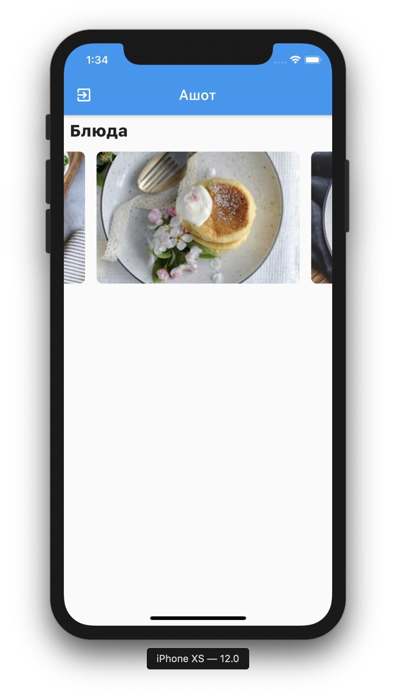

# ashot 👨‍🦰

The best delivery application.

<p align="center">
  
</p>

## Getting Started

This project is a starting point for a Flutter application.

## Installing

```bash
# Generate data classes
$ flutter pub run build_runner watch --delete-conflicting-outputs

# Run on device
$ flutter run
```
